# Cache IoT device data for quick Carbon Design System front-ends

This code pattern demonstrates an API caching server that can reside between your Carbon Design System based front-end and the API's for your IoT device data, and can help with building quick and efficient interfaces using IBM Carbon UI. The pattern showcases a Node.js server built using Loopback.io that the front-end of an application would communicate with, and which interacts with an IBM Cloudant database that holds information about your IoT device so that your application has cached data even when intermittent communication failures occur with the IoT device.

When the reader has completed this code pattern, they will understand how to:

* Create a Node.js and Loopback.io backend server
* Create API's using Loopback.io
* Setup IBM Cloudant and interface with Loopback.io
* Run IBM cloudant database locally
* Setup a mock IOT device on Internet of Things Platform

# Architecture Flow

<p align="center">
  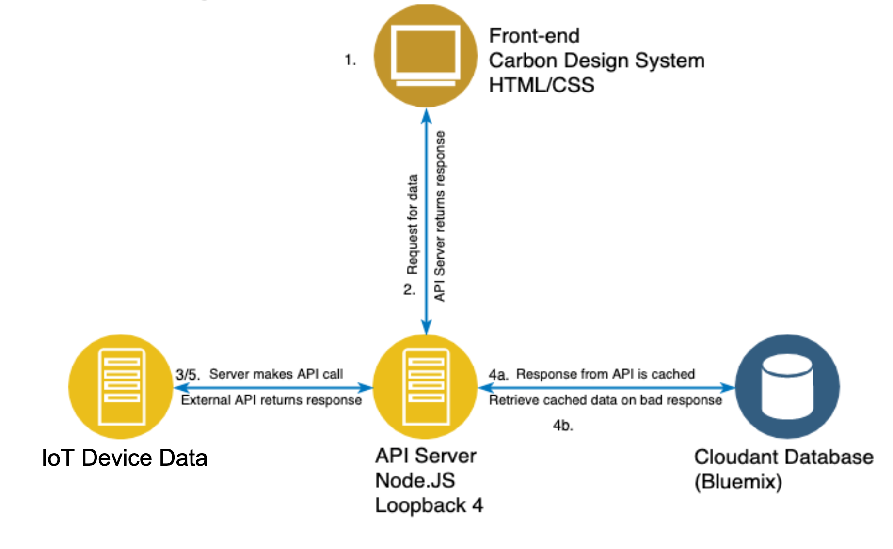
</p>

1. User authenticates to API Server through Carbon Design System based front-end
2. Front-end makes request data to be visualized from REST API
3. API Server makes request to IoT device data API with stored credentials for that API
4. If...
   1. there is a good response, the API Server receives new data and caches, then sends it to the front-end
   2. there is a bad response, the API server retrieves previously cached and returns THAT to the front-end
5. On a given interval, the API server refreshes the data it has stored for the collections of APIs it has information on

# Included Components

* [IBM Carbon Design System](https://www.carbondesignsystem.com) is IBM’s open-source design system for products and experiences. With the IBM Design Language as its foundation, the system consists of working code, design tools and resources, human interface guidelines, and a vibrant community of contributors.
* [IBM Cloudant](https://www.ibm.com/cloud/cloudant) is a fully managed, scalable distributed database that gives you more time to focus on what matters – building your product.
* [IBM Internet of Things Platform](https://cloud.ibm.com/catalog/services/internet-of-things-platform) - Securely connect, control, and manage devices. Quickly build IoT applications that analyze data from the physical world.

## Featured technology
+ [Node.js](https://nodejs.org) is an open source, cross-platform JavaScript run-time environment that executes server-side JavaScript code.
+ [Loopback.io](https://loopback.io/) LoopBack is a highly extensible, open-source Node.js framework based on Express that enables you to quickly create dynamic end-to-end REST APIs and connect to backend systems such as databases and SOAP or REST services.
+ [Docker](https://www.docker.com/) independent container platform that enables organizations to seamlessly build, share and run any application, anywhere—from hybrid cloud to the edge.
+ [Postman](https://www.getpostman.com/) is the only complete API development environment, and flexibly integrates with the software development cycle.

## Running the application locally

Follow these steps to set up and run this code pattern. The steps are described in detail below.

### Prerequisites

- [Node v8.x or greater and npm v5.x or greater](https://nodejs.org/en/download/)
- [Docker version v17.06.2-ce or greater](https://www.docker.com/get-docker)
- [Docker Compose v1.14.0 or greater](https://docs.docker.com/compose/install/)
- [Download Postman](https://www.getpostman.com/)

### Steps
1. [Clone the repository](#1-clone-the-repository)
2. [Setup cloudant database](#2-setup-cloudant-database)
3. [Setup mock IoT device](#3-setup-mock-iot-device)
4. [Run the application](#4-run-the-application)
5. [The API](#5-the-api)

## 1. Clone the repository

Clone this repository in a folder your choice:

```bash
git clone https://github.com/IBM/cache-IoT-data-for-Carbon-UI.git
cd cache-IoT-data-for-Carbon-UI
```

## 2. Setup cloudant database

If you want to use a local version of Cloudant, download the cloudant-developer container via the the following command:
```
docker run \
      --volume cloudant:/srv \
      --name cloudant-developer \
      --publish 8080:80 \
      --hostname cloudant.dev \
      ibmcom/cloudant-developer
```
This will have your local Cloudant image running at http://localhost:8080/dashboard.html#. The default login credentials are
```
username: admin
password: pass
```
To restart the Docker container if it stops, or your local machine restarts, simply use the command
```
docker start cloudant-developer
```

For instructions on using Loopback to deploy to IBM Cloud, see this link for more information: https://loopback.io/doc/en/lb4/Deploying-to-IBM-Cloud.html.

Once your Cloudant database is configured, we will need to create 4 databases on your local database. See the image below to see what your database should look like once your database is ready to be used.

<p align="center">
  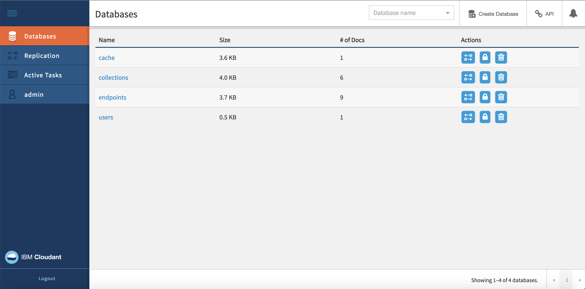
</p>

## 3. Setup mock IoT device

Provision a lite plan of the [IBM Internet of Things Platform](https://cloud.ibm.com/catalog/services/internet-of-things-platform).

<p align="center">
  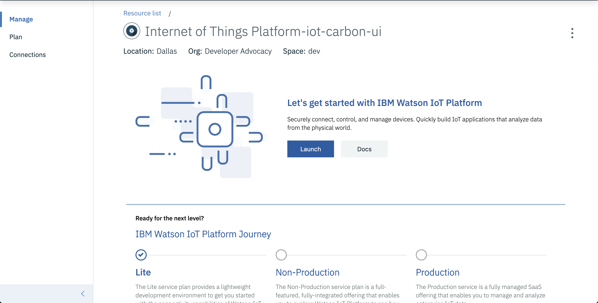
</p>

Navigate to `Settings` -> `Device Simulator`, and toggle the `Activate Device Simulator` button.

<p align="center">
  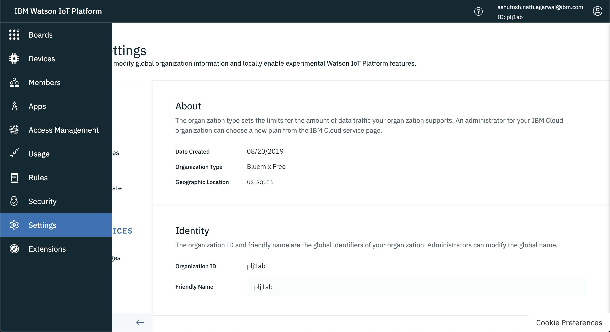
</p>

<p align="center">
  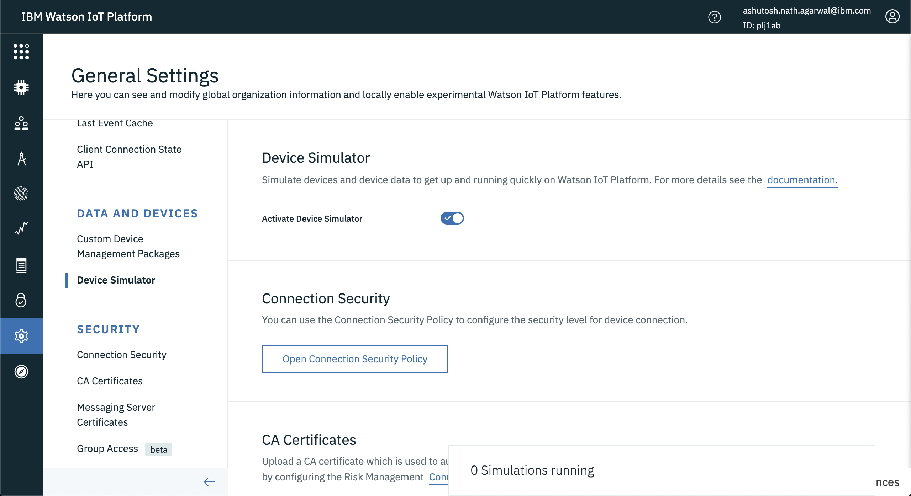
</p>

Click on the panel `0 Simulations running`, and create a simulation called `mydevice`.

<p align="center">
  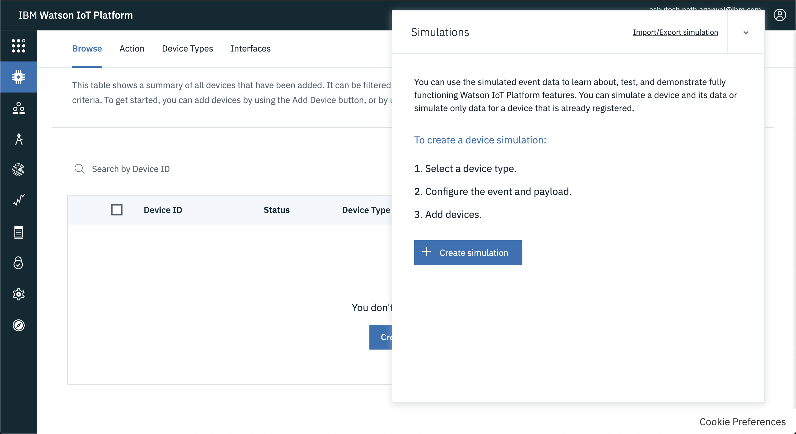
</p>

<p align="center">
  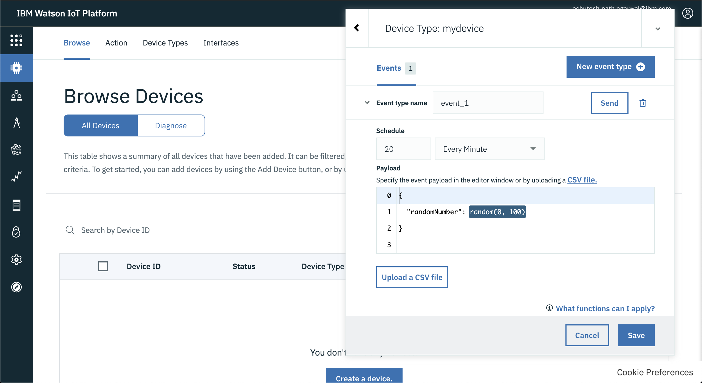
</p>

Click on `Create simulated device` to simulate an IoT device.

<p align="center">
  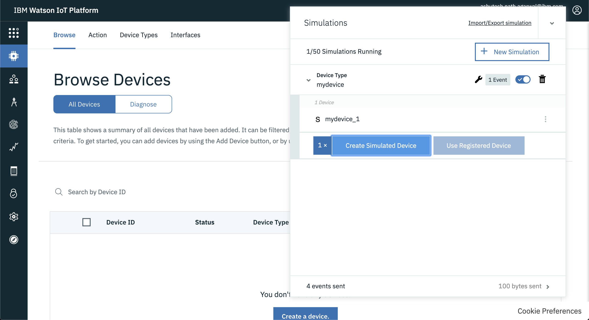
</p>

You can view your new mock IoT device transmitting data under `Browse Devices`.

<p align="center">
  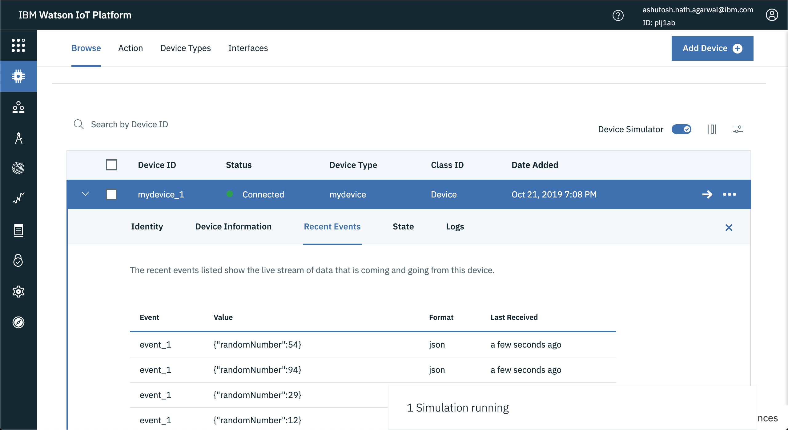
</p>

Now, access the device data over `HTTP`, and use the data URL for caching for the next steps.

## 4. Run the application

Run the following command at the root level of the project to install all necessary dependencies.
```
npm install
npm start
```
With this, the server should be running locally on port 3000. Loopback also automatically generates a simple API explorer at 127.0.0.1:3000/explorer. See screenshots below for what successful server start should look like.

<p align="center">
  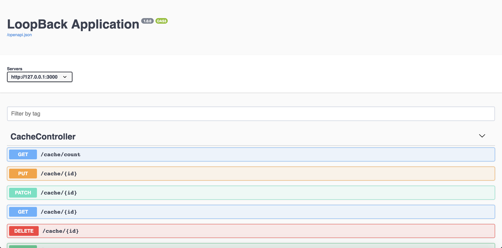
</p>

<p align="center">
  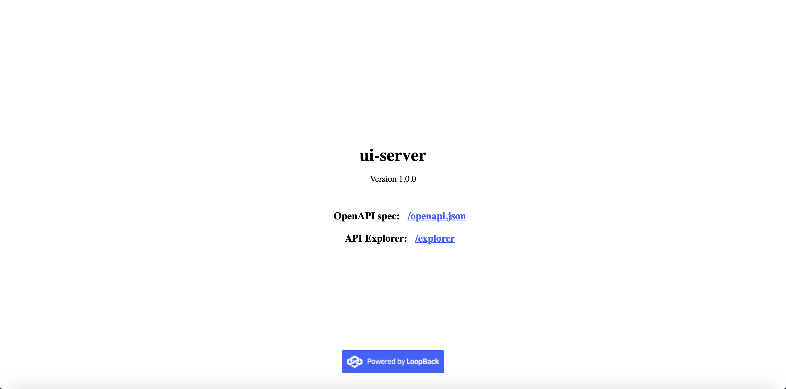
</p>

## 5. The API

The API contains a few simple classes: Users, Collections, Endpoints, and the Cache.

### Users
Users are a simple class that we use for authentication (it will matter more once the server is hosted on IBM Cloud). To register a new user is a simple POST request to the '/register/ endpoint. The request body should follow the example format below:
```
{
  "username": "Tony.Melo1@ibm.com",
  "password": "example"
}
```
Upon successful registration, you can pass your username and password in the 'Authorization' header of requests when calling the API.

<p align="center">
  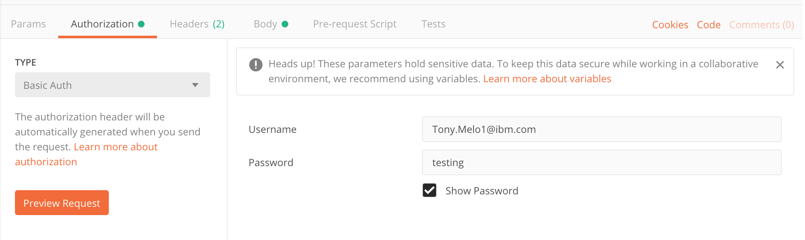
</p>

### Collections
Collections represent the "higher" level information on a collection of APIs. Collections contain the following fields that are sent as JSON in the request body via POST requests:
```
{
"collectionID": String (example: "buildingInsights"),
"collectionName": String (example: "estateAPIs"),
"baseURL": String (this string corresponds to the base of the API you'd like to call e.g.
"https://iotbi-customdashboard.mybluemix.net/cache/allData?api="),
"authenticationType": String (must be either "Basic" or "Bearer"),
"refreshInterval": Number (how often you'd like to refresh the collection, e.g. 60 => refresh every 60 seconds),
"credentials": Object (must contain a field for username and password, e.g. 
{"username": "Tony.Melo1@ibm.com", "password": "example"}),
"cacheLocation": String (must be either "memory" or "db")
}
```
To create a new collection, send a POST request from Postman or using curl from terminal to the url 127.0.0.1:3000/collections with a JSON object that matches the above format (fields can be sent in any order in the object). For information on a particular collection, simply send a GET request to 127.0.0.1:3000/collections/{id}, where {id} is the ID number of the collection you would like to know more about. In order to properly perform a request, make sure to set the "Content-Type" header to be "application/json", and pass your registered credentials via Basic Auth.
Example creation request:

<p align="center">
  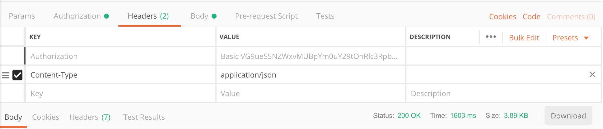
</p>

<p align="center">
  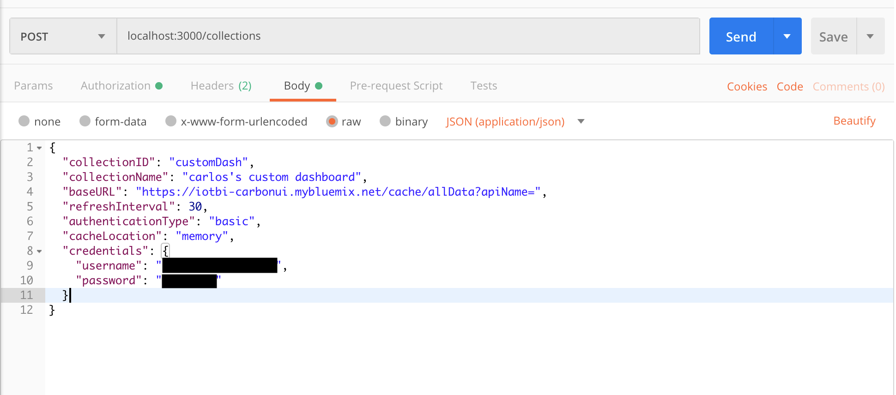
</p>

### Endpoints
Endpoints are how we store the actual APIs that we will be calling. Endpoints contain similar fields to the collection they belong to, however, certain fields will be inherited from the collection if omitted at the endpoint level. To create a new Endpoint, send a POST request to 127.0.0.1:3000/endpoints with the request body of the following format:
```
{
"endpointID": String (example: "usage"),
"collectionID": String (this should correspond to an existing collection you want the endpoint to belong to),
"endpointPath": String (this corresponds to a string like "/v1/estate/energy/usage" that is appended to the collection's baseURL),
"credentials": Object (NOT REQUIRED, will be inherited from the collection if omitted),
"refreshInterval": Number (NOT REQUIRED, will be inherited from the collection if omitted),
"authenticationType": String (NOT REQUIRED, will be inherited from the collection if omitted),
"baseURL": String (NOT REQUIRED, will be inherited from the collection if omitted),
"endpointList": String[] (NOT REQUIRED, if you so desire, you can pass an array of endpoint paths here instead of registering paths 1 by 1)

}
```
Example endpoint creation:

<p align="center">
  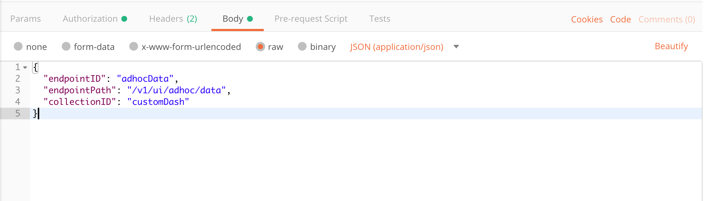
</p>

### Cache
This class is what is used as our data store for anything retrieved from our APIs. In order to refresh the data store, you can hit 127.0.0.1:3000/cache with a POST request with a request body of the following format:
```
{
"collectionID": String (must correspond to an existing collection we'll be caching data for)
}
```
The data for that collection will map every endpoint path to its corresponding API response.
Example Cache creation with data schema and response:

<p align="center">
  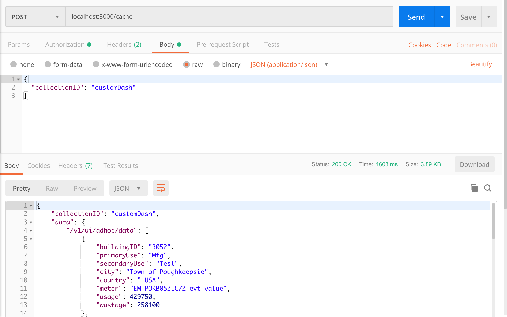
</p>

## Links
* [IBM Carbon Design System tutorial](http://www.carbondesignsystem.com/tutorial/overview)
* [IBM Code Patterns for Node.js](https://developer.ibm.com/patterns/category/node-js/)

## License
This code pattern is licensed under the Apache Software License, Version 2. Separate third-party code objects invoked within this code pattern are licensed by their respective providers pursuant to their own separate licenses. Contributions are subject to the [Developer Certificate of Origin, Version 1.1 (DCO)](https://developercertificate.org/) and the [Apache Software License, Version 2](https://www.apache.org/licenses/LICENSE-2.0.txt).

[Apache Software License (ASL) FAQ](https://www.apache.org/foundation/license-faq.html#WhatDoesItMEAN)
